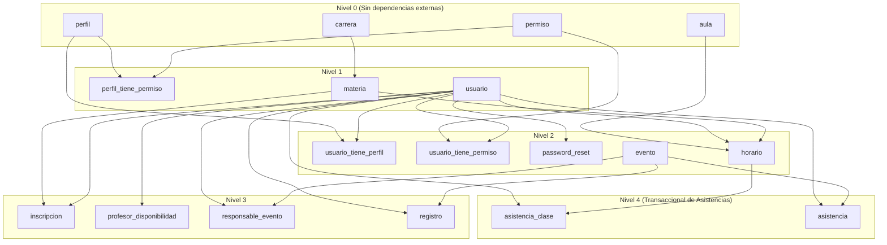

# Documento de Diseño Técnico: Migración de Modelos a Django ORM
**Proyecto:** Pasaporte2  
**Origen:** PHP 8 / MySQL (Motor Active Record Propio)  
**Destino:** Python 3.11+ / Django 4.2+ ó 5.x ORM  
**Versión del Documento:** 1.0  
**Fecha:** Septiembre 2026  

---

## 1. Alcance y Arquitectura de la Migración

El objetivo de este documento es proporcionar el **diseño formal y exhaustivo de todos los modelos de base de datos** para migrar la capa de persistencia de **Pasaporte2** hacia **Django ORM**.

### 1.1. Arquitectura Modular en Django
Para mantener alta cohesión y bajo acoplamiento, el esquema se divide en 3 aplicaciones Django más un módulo de reportes:

```
pasaporte_django/
├── apps/
│   ├── usuarios/      # Usuario (Custom User), Perfil, Permiso, PasswordReset
│   ├── academico/     # Carrera, Aula, Materia, Horario, Inscripcion, AsistenciaClase, Disponibilidad
│   └── eventos/       # Evento, Registro, Asistencia, ResponsableEvento
└── reportes/          # Modelos no gestionados (managed=False) para vistas SQL
```

---

## 2. Diccionario de Datos y Matriz de Equivalencias (MySQL -> Django ORM)

### 2.1. Módulo de Seguridad y Accesos (`usuarios`)

| Tabla MySQL | Columna MySQL | Tipo MySQL | Equivalente Django Field | Restricciones / Opciones |
|---|---|---|---|---|
| **permiso** | `id` | BIGINT AUTO_INCREMENT | `BigAutoField(primary_key=True)` | Clave primaria |
| | `tipo` | VARCHAR(100) | `CharField(max_length=100)` | Módulo del permiso |
| | `codename` | VARCHAR(100) | `CharField(max_length=100, unique=True)` | Único |
| | `nombre` | VARCHAR(100) | `CharField(max_length=100, null=True, blank=True)` | Opcional |
| **perfil** | `id` | BIGINT AUTO_INCREMENT | `BigAutoField(primary_key=True)` | Clave primaria |
| | `nombre` | VARCHAR(50) | `CharField(max_length=50)` | Nombre del rol |
| | *(relación)* | - | `ManyToManyField('Permiso', through='PerfilTienePermiso')` | N:M |
| **perfil_tiene_permiso** | `perfil_id` | BIGINT | `ForeignKey('Perfil', on_delete=CASCADE)` | FK a perfil |
| | `permiso_id` | BIGINT | `ForeignKey('Permiso', on_delete=RESTRICT)` | FK a permiso |
| **usuario** | `id` | BIGINT AUTO_INCREMENT | `BigAutoField(primary_key=True)` | Clave primaria |
| | `username` | VARCHAR(50) | `CharField(max_length=50, unique=True)` | Identificador de login |
| | `password` | VARCHAR(255) | `CharField(max_length=255)` | Hash bcrypt / pbkdf2 |
| | `activo` | TINYINT(1) | `BooleanField(default=True)` | Estado de cuenta |
| | `superusuario`| TINYINT(1) | `BooleanField(default=False)` | Acceso total |
| | `nombre` | VARCHAR(50) | `CharField(max_length=50, null=True, blank=True)` | Opcional |
| | `apaterno` | VARCHAR(50) | `CharField(max_length=50, null=True, blank=True)` | Opcional |
| | `amaterno` | VARCHAR(50) | `CharField(max_length=50, null=True, blank=True)` | Opcional |
| | `email` | VARCHAR(50) | `EmailField(max_length=50, unique=True)` | Único |
| | `categoria` | VARCHAR(50) | `CharField(max_length=50, null=True, blank=True)` | Alumno, docente, etc. |
| | `whatsapp` | VARCHAR(50) | `CharField(max_length=50)` | Obligatorio |
| | `grupo` | VARCHAR(50) | `CharField(max_length=50)` | Grupo académico |
| | `matricula` | VARCHAR(50) | `CharField(max_length=50, null=True, blank=True)` | Matrícula escolar |
| **usuario_tiene_perfil**| `usuario_id` | BIGINT | `ForeignKey('Usuario', on_delete=CASCADE)` | FK a usuario |
| | `perfil_id` | BIGINT | `ForeignKey('Perfil', on_delete=RESTRICT)` | FK a perfil |
| **usuario_tiene_permiso**| `usuario_id`| BIGINT | `ForeignKey('Usuario', on_delete=CASCADE)` | FK a usuario |
| | `permiso_id` | BIGINT | `ForeignKey('Permiso', on_delete=RESTRICT)` | FK a permiso |
| **password_reset** | `token` | VARCHAR(64) | `CharField(max_length=64, primary_key=True)` | Clave primaria (hash token) |
| | `usuario_id` | BIGINT | `ForeignKey('Usuario', on_delete=CASCADE)` | FK a usuario |
| | `expira_en` | DATETIME | `DateTimeField()` | Fecha de expiración |

---

### 2.2. Módulo Académico (`academico`)

| Tabla MySQL | Columna MySQL | Tipo MySQL | Equivalente Django Field | Restricciones / Opciones |
|---|---|---|---|---|
| **carrera** | `id` | BIGINT AUTO_INCREMENT | `BigAutoField(primary_key=True)` | Clave primaria |
| | `clave` | VARCHAR(20) | `CharField(max_length=20, unique=True)` | Único |
| | `nombre` | VARCHAR(200) | `CharField(max_length=200)` | Nombre oficial |
| | `activa` | TINYINT(1) | `BooleanField(default=True)` | Estado |
| **aula** | `id` | BIGINT AUTO_INCREMENT | `BigAutoField(primary_key=True)` | Clave primaria |
| | `codigo` | VARCHAR(30) | `CharField(max_length=30, unique=True)` | Ej: 'A-101' |
| | `edificio` | VARCHAR(100) | `CharField(max_length=100, null=True, blank=True)`| Opcional |
| | `capacidad` | INT UNSIGNED | `PositiveIntegerField(null=True, blank=True)` | Opcional |
| | `tipo` | ENUM(...) | `CharField(max_length=20, choices=TIPO_CHOICES)` | aula, laboratorio, etc. |
| | `activa` | TINYINT(1) | `BooleanField(default=True)` | Estado |
| **materia** | `id` | BIGINT AUTO_INCREMENT | `BigAutoField(primary_key=True)` | Clave primaria |
| | `clave` | VARCHAR(30) | `CharField(max_length=30, unique=True)` | Ej: 'TC1018' |
| | `nombre` | VARCHAR(200) | `CharField(max_length=200)` | Nombre |
| | `asistencias`| INT UNSIGNED | `PositiveIntegerField(default=0)` | Meta de asistencias |
| | `horas_semana`| INT UNSIGNED | `PositiveIntegerField(default=0)` | Carga horaria semanal |
| | `periodo` | VARCHAR(30) | `CharField(max_length=30, null=True, blank=True)`| Cuatrimestre / periodo |
| | `carrera_id` | BIGINT | `ForeignKey('Carrera', on_delete=SET_NULL, null=True)`| FK opcional |
| | `activa` | TINYINT(1) | `BooleanField(default=True)` | Estado |
| **horario** | `id` | BIGINT AUTO_INCREMENT | `BigAutoField(primary_key=True)` | Clave primaria |
| | `materia_id` | BIGINT | `ForeignKey('Materia', on_delete=RESTRICT)` | FK obligatoria |
| | `profesor_id`| BIGINT | `ForeignKey('Usuario', on_delete=RESTRICT)` | Docente asignado |
| | `aula_id` | BIGINT | `ForeignKey('Aula', on_delete=SET_NULL, null=True)` | Aula física |
| | `grupo` | VARCHAR(10) | `CharField(max_length=10, default='A')` | Grupo |
| | `dia_semana` | ENUM(...) | `CharField(max_length=15, choices=DIAS_CHOICES)`| lunes a sábado |
| | `hora_inicio`| TIME | `TimeField()` | Inicio de clase |
| | `hora_fin` | TIME | `TimeField()` | Fin de clase |
| | `periodo` | VARCHAR(30) | `CharField(max_length=30)` | Ciclo escolar |
| | `activo` | TINYINT(1) | `BooleanField(default=True)` | Estado |
| | *(slot único)*| - | `UniqueConstraint(fields=['aula','dia_semana','hora_inicio','periodo'])` | Evita colisiones de aula |
| **profesor_disponibilidad** | `id` | BIGINT AUTO_INCREMENT | `BigAutoField(primary_key=True)` | Clave primaria |
| | `profesor_id`| BIGINT | `ForeignKey('Usuario', on_delete=CASCADE)` | Docente |
| | `dia_semana` | ENUM(...) | `CharField(max_length=15, choices=DIAS_CHOICES)`| Día |
| | `hora_inicio`| TIME | `TimeField()` | Inicio bloque |
| | `hora_fin` | TIME | `TimeField()` | Fin bloque |
| | `periodo` | VARCHAR(30) | `CharField(max_length=30)` | Periodo |
| | `tipo` | ENUM(...) | `CharField(max_length=20, choices=TIPO_DISP)` | disponible / no_disponible |
| | `notas` | VARCHAR(200) | `CharField(max_length=200, null=True, blank=True)`| Observaciones |
| **inscripcion** | `id` | BIGINT AUTO_INCREMENT | `BigAutoField(primary_key=True)` | Clave primaria |
| | `usuario_id` | BIGINT | `ForeignKey('Usuario', on_delete=CASCADE)` | Alumno |
| | `materia_id` | BIGINT | `ForeignKey('Materia', on_delete=RESTRICT)` | Asignatura |
| | `grupo` | VARCHAR(10) | `CharField(max_length=10, default='A')` | Grupo |
| | `periodo` | VARCHAR(30) | `CharField(max_length=30)` | Ciclo |
| | `fecha_inscripcion`| DATETIME | `DateTimeField(auto_now_add=True)` | Timestamp |
| | `activa` | TINYINT(1) | `BooleanField(default=True)` | Estado |
| | *(inscripción única)*| - | `UniqueConstraint(fields=['usuario','materia','grupo','periodo'])` | Evita duplicidad |
| **asistencia_clase** | `id` | BIGINT AUTO_INCREMENT | `BigAutoField(primary_key=True)` | Clave primaria |
| | `horario_id` | BIGINT | `ForeignKey('Horario', on_delete=CASCADE)` | Sesión de clase |
| | `usuario_id` | BIGINT | `ForeignKey('Usuario', on_delete=CASCADE)` | Alumno presente |
| | `fecha` | DATE | `DateField()` | Día de asistencia |
| | `hora` | TIME | `TimeField()` | Hora exacta de lectura |
| | `estado` | ENUM(...) | `CharField(max_length=15, choices=ESTADO_CHOICES)`| presente, retardo, etc. |
| | `metodo` | ENUM(...) | `CharField(max_length=10, choices=METODO_CHOICES)`| qr / manual |
| | *(asistencia única)*| - | `UniqueConstraint(fields=['horario','usuario','fecha'])` | 1 registro por alumno/día |

---

### 2.3. Módulo de Eventos (`eventos`)

| Tabla MySQL | Columna MySQL | Tipo MySQL | Equivalente Django Field | Restricciones / Opciones |
|---|---|---|---|---|
| **evento** | `id` | BIGINT AUTO_INCREMENT | `BigAutoField(primary_key=True)` | Clave primaria |
| | `nombre` | VARCHAR(200) | `CharField(max_length=200)` | Título |
| | `fecha_hora` | DATETIME | `DateTimeField()` | Fecha y hora |
| | `lugar` | VARCHAR(200) | `CharField(max_length=200, null=True, blank=True)`| Ubicación |
| | `requiere_registro`| TINYINT(1) | `BooleanField(default=True, null=True)` | Control previo |
| | `permitir_autorregistro`| TINYINT(1) | `BooleanField(default=True, null=True)` | Auto-inscripción alumno |
| | `responsable_interno` | VARCHAR(200) | `CharField(max_length=200, null=True, blank=True)`| Nombre contacto |
| | `responsable_externo` | VARCHAR(200) | `CharField(max_length=200, null=True, blank=True)`| Nombre externo |
| **registro** | `evento_id` | BIGINT | `ForeignKey('Evento', on_delete=RESTRICT)` | Evento |
| | `usuario_id` | BIGINT | `ForeignKey('Usuario', on_delete=RESTRICT)` | Asistente |
| | `fecha_registro` | DATETIME | `DateTimeField(auto_now_add=True)` | Momento registro |
| | `equipo` | VARCHAR(50) | `CharField(max_length=50, null=True, blank=True)` | Opcional |
| **asistencia** | `evento_id` | BIGINT | `ForeignKey('Evento', on_delete=CASCADE)` | Evento |
| | `usuario_id` | BIGINT | `ForeignKey('Usuario', on_delete=CASCADE)` | Asistente |
| | `registrado_por` | BIGINT | `ForeignKey('Usuario', on_delete=RESTRICT)` | Staff que escaneó |
| | `fecha_entrada` | DATETIME | `DateTimeField(auto_now_add=True)` | Momento de acceso |
| **responsable_evento** | `evento_id` | BIGINT | `ForeignKey('Evento', on_delete=CASCADE)` | Evento |
| | `usuario_id` | BIGINT | `ForeignKey('Usuario', on_delete=CASCADE)` | Organizador |

---

## 3. Especificación Formal de Modelos en Código Python (Django)

### 3.1. `apps/usuarios/models.py`
```python
from django.db import models
from django.contrib.auth.models import AbstractBaseUser, BaseUserManager

class Permiso(models.Model):
    id = models.BigAutoField(primary_key=True)
    tipo = models.CharField(max_length=100, verbose_name="Tipo / Módulo")
    codename = models.CharField(max_length=100, unique=True, verbose_name="Código")
    nombre = models.CharField(max_length=100, null=True, blank=True, verbose_name="Nombre descriptivo")

    class Meta:
        db_table = "permiso"
        verbose_name = "Permiso"
        verbose_name_plural = "Permisos"
        ordering = ["tipo", "codename"]

    def __str__(self):
        return f"{self.tipo}.{self.codename}"

class Perfil(models.Model):
    id = models.BigAutoField(primary_key=True)
    nombre = models.CharField(max_length=50, verbose_name="Nombre del perfil")
    permisos = models.ManyToManyField(
        Permiso,
        through="PerfilTienePermiso",
        related_name="perfiles",
        blank=True
    )

    class Meta:
        db_table = "perfil"
        verbose_name = "Perfil / Rol"
        verbose_name_plural = "Perfiles / Roles"
        ordering = ["nombre"]

    def __str__(self):
        return self.nombre

    def tiene_permiso(self, perm_str: str) -> bool:
        if "." in perm_str:
            tipo, codename = perm_str.split(".", 1)
            if codename == "*":
                return self.permisos.filter(tipo=tipo).exists()
            return self.permisos.filter(tipo=tipo, codename=codename).exists()
        return False

class PerfilTienePermiso(models.Model):
    perfil = models.ForeignKey(Perfil, on_delete=models.CASCADE, db_column="perfil_id")
    permiso = models.ForeignKey(Permiso, on_delete=models.RESTRICT, db_column="permiso_id")

    class Meta:
        db_table = "perfil_tiene_permiso"
        unique_together = (("perfil", "permiso"),)
        verbose_name = "Permiso de Perfil"
        verbose_name_plural = "Permisos de Perfiles"

class UsuarioManager(BaseUserManager):
    def create_user(self, username, email, password=None, **extra_fields):
        if not email:
            raise ValueError("El email es obligatorio.")
        if not username:
            raise ValueError("El username es obligatorio.")
        email = self.normalize_email(email)
        user = self.model(username=username, email=email, **extra_fields)
        if password:
            user.set_password(password)
        user.save(using=self._db)
        return user

    def create_superuser(self, username, email, password=None, **extra_fields):
        extra_fields.setdefault("superusuario", True)
        extra_fields.setdefault("activo", True)
        return self.create_user(username, email, password, **extra_fields)

class Usuario(AbstractBaseUser):
    id = models.BigAutoField(primary_key=True)
    username = models.CharField(max_length=50, unique=True, verbose_name="Usuario")
    password = models.CharField(max_length=255, verbose_name="Contraseña")
    activo = models.BooleanField(default=True, verbose_name="¿Activo?")
    superusuario = models.BooleanField(default=False, verbose_name="¿Superusuario?")

    nombre = models.CharField(max_length=50, null=True, blank=True, verbose_name="Nombre(s)")
    apaterno = models.CharField(max_length=50, null=True, blank=True, verbose_name="Apellido Paterno")
    amaterno = models.CharField(max_length=50, null=True, blank=True, verbose_name="Apellido Materno")
    email = models.EmailField(max_length=50, unique=True, verbose_name="Correo electrónico")
    categoria = models.CharField(max_length=50, null=True, blank=True, verbose_name="Categoría")
    whatsapp = models.CharField(max_length=50, verbose_name="WhatsApp")
    grupo = models.CharField(max_length=50, verbose_name="Grupo")
    matricula = models.CharField(max_length=50, null=True, blank=True, verbose_name="Matrícula")

    perfiles = models.ManyToManyField(
        Perfil,
        through="UsuarioTienePerfil",
        related_name="usuarios",
        blank=True
    )
    permisos_directos = models.ManyToManyField(
        Permiso,
        through="UsuarioTienePermiso",
        related_name="usuarios",
        blank=True
    )

    objects = UsuarioManager()

    USERNAME_FIELD = "username"
    EMAIL_FIELD = "email"
    REQUIRED_FIELDS = ["email"]

    class Meta:
        db_table = "usuario"
        verbose_name = "Usuario"
        verbose_name_plural = "Usuarios"
        ordering = ["nombre", "apaterno", "amaterno"]

    def __str__(self):
        nombre_completo = f"{self.nombre or ''} {self.apaterno or ''} {self.amaterno or ''}".strip()
        return nombre_completo if nombre_completo else self.username

    @property
    def is_staff(self):
        return self.superusuario

    @property
    def is_superuser(self):
        return self.superusuario

    @property
    def is_active(self):
        return self.activo

    def has_perm(self, perm, obj=None):
        if self.superusuario:
            return True
        if self.permisos_directos.filter(codename=perm).exists():
            return True
        return self.perfiles.filter(permisos__codename=perm).exists()

    def has_module_perms(self, app_label):
        return self.superusuario

class UsuarioTienePerfil(models.Model):
    usuario = models.ForeignKey(Usuario, on_delete=models.CASCADE, db_column="usuario_id")
    perfil = models.ForeignKey(Perfil, on_delete=models.RESTRICT, db_column="perfil_id")

    class Meta:
        db_table = "usuario_tiene_perfil"
        unique_together = (("usuario", "perfil"),)
        verbose_name = "Perfil de Usuario"
        verbose_name_plural = "Perfiles de Usuarios"

class UsuarioTienePermiso(models.Model):
    usuario = models.ForeignKey(Usuario, on_delete=models.CASCADE, db_column="usuario_id")
    permiso = models.ForeignKey(Permiso, on_delete=models.RESTRICT, db_column="permiso_id")

    class Meta:
        db_table = "usuario_tiene_permiso"
        unique_together = (("usuario", "permiso"),)
        verbose_name = "Permiso directo de Usuario"
        verbose_name_plural = "Permisos directos de Usuarios"

class PasswordReset(models.Model):
    token = models.CharField(max_length=64, primary_key=True)
    usuario = models.ForeignKey(Usuario, on_delete=models.CASCADE, db_column="usuario_id")
    expira_en = models.DateTimeField(verbose_name="Fecha de expiración")

    class Meta:
        db_table = "password_reset"
        verbose_name = "Token de Recuperación"
        verbose_name_plural = "Tokens de Recuperación"
```

---

### 3.2. `apps/academico/models.py`
```python
from django.db import models
from django.conf import settings

class Carrera(models.Model):
    id = models.BigAutoField(primary_key=True)
    clave = models.CharField(max_length=20, unique=True, verbose_name="Clave")
    nombre = models.CharField(max_length=200, verbose_name="Nombre de la carrera")
    activa = models.BooleanField(default=True, verbose_name="¿Activa?")

    class Meta:
        db_table = "carrera"
        verbose_name = "Carrera"
        verbose_name_plural = "Carreras"
        ordering = ["nombre"]

    def __str__(self):
        return f"{self.clave} - {self.nombre}"

class Aula(models.Model):
    TIPO_CHOICES = [
        ("aula", "Aula"),
        ("laboratorio", "Laboratorio"),
        ("auditorio", "Auditorio"),
        ("taller", "Taller"),
        ("otro", "Otro"),
    ]

    id = models.BigAutoField(primary_key=True)
    codigo = models.CharField(max_length=30, unique=True, verbose_name="Código del aula")
    edificio = models.CharField(max_length=100, null=True, blank=True, verbose_name="Edificio")
    capacidad = models.PositiveIntegerField(null=True, blank=True, verbose_name="Capacidad")
    tipo = models.CharField(max_length=20, choices=TIPO_CHOICES, default="aula", verbose_name="Tipo")
    activa = models.BooleanField(default=True, verbose_name="¿Activa?")

    class Meta:
        db_table = "aula"
        verbose_name = "Aula"
        verbose_name_plural = "Aulas"
        ordering = ["codigo"]

    def __str__(self):
        return f"{self.codigo} ({self.edificio or 'Sin edificio'})"

class Materia(models.Model):
    id = models.BigAutoField(primary_key=True)
    clave = models.CharField(max_length=30, unique=True, verbose_name="Clave de materia")
    nombre = models.CharField(max_length=200, verbose_name="Nombre de la asignatura")
    asistencias = models.PositiveIntegerField(default=0, verbose_name="Asistencias mínimas")
    horas_semana = models.PositiveIntegerField(default=0, verbose_name="Horas semanales")
    periodo = models.CharField(max_length=30, null=True, blank=True, verbose_name="Periodo / Cuatrimestre")
    carrera = models.ForeignKey(
        Carrera,
        on_delete=models.SET_NULL,
        null=True,
        blank=True,
        related_name="materias",
        db_column="carrera_id"
    )
    activa = models.BooleanField(default=True, verbose_name="¿Activa?")

    class Meta:
        db_table = "materia"
        verbose_name = "Materia"
        verbose_name_plural = "Materias"
        ordering = ["nombre"]

    def __str__(self):
        return f"{self.clave} - {self.nombre}"

class DiaSemanaChoices(models.TextChoices):
    LUNES = "lunes", "Lunes"
    MARTES = "martes", "Martes"
    MIERCOLES = "miercoles", "Miércoles"
    JUEVES = "jueves", "Jueves"
    VIERNES = "viernes", "Viernes"
    SABADO = "sabado", "Sábado"

class Horario(models.Model):
    id = models.BigAutoField(primary_key=True)
    materia = models.ForeignKey(Materia, on_delete=models.RESTRICT, related_name="horarios", db_column="materia_id")
    profesor = models.ForeignKey(settings.AUTH_USER_MODEL, on_delete=models.RESTRICT, related_name="horarios_impartidos", db_column="profesor_id")
    aula = models.ForeignKey(Aula, on_delete=models.SET_NULL, null=True, blank=True, related_name="horarios", db_column="aula_id")
    grupo = models.CharField(max_length=10, default="A", verbose_name="Grupo")
    dia_semana = models.CharField(max_length=15, choices=DiaSemanaChoices.choices, verbose_name="Día")
    hora_inicio = models.TimeField(verbose_name="Hora de inicio")
    hora_fin = models.TimeField(verbose_name="Hora de fin")
    periodo = models.CharField(max_length=30, verbose_name="Periodo académico")
    activo = models.BooleanField(default=True, verbose_name="¿Activo?")

    class Meta:
        db_table = "horario"
        verbose_name = "Horario de Clase"
        verbose_name_plural = "Horarios de Clases"
        constraints = [
            models.UniqueConstraint(
                fields=["aula", "dia_semana", "hora_inicio", "periodo"],
                name="uq_horario_slot"
            )
        ]
        ordering = ["periodo", "dia_semana", "hora_inicio"]

    def __str__(self):
        return f"{self.materia.nombre} | {self.dia_semana} {self.hora_inicio}-{self.hora_fin}"

class ProfesorDisponibilidad(models.Model):
    TIPO_CHOICES = [
        ("disponible", "Disponible"),
        ("no_disponible", "No disponible"),
    ]

    id = models.BigAutoField(primary_key=True)
    profesor = models.ForeignKey(settings.AUTH_USER_MODEL, on_delete=models.CASCADE, related_name="disponibilidades", db_column="profesor_id")
    dia_semana = models.CharField(max_length=15, choices=DiaSemanaChoices.choices)
    hora_inicio = models.TimeField()
    hora_fin = models.TimeField()
    periodo = models.CharField(max_length=30)
    tipo = models.CharField(max_length=20, choices=TIPO_CHOICES, default="disponible")
    notas = models.CharField(max_length=200, null=True, blank=True)

    class Meta:
        db_table = "profesor_disponibilidad"
        constraints = [
            models.UniqueConstraint(
                fields=["profesor", "dia_semana", "hora_inicio", "periodo"],
                name="uk_profesor_disp_bloque"
            )
        ]
        verbose_name = "Disponibilidad de Profesor"
        verbose_name_plural = "Disponibilidades de Profesores"

class Inscripcion(models.Model):
    id = models.BigAutoField(primary_key=True)
    usuario = models.ForeignKey(settings.AUTH_USER_MODEL, on_delete=models.CASCADE, related_name="inscripciones", db_column="usuario_id")
    materia = models.ForeignKey(Materia, on_delete=models.RESTRICT, related_name="inscripciones", db_column="materia_id")
    grupo = models.CharField(max_length=10, default="A")
    periodo = models.CharField(max_length=30)
    fecha_inscripcion = models.DateTimeField(auto_now_add=True)
    activa = models.BooleanField(default=True)

    class Meta:
        db_table = "inscripcion"
        constraints = [
            models.UniqueConstraint(
                fields=["usuario", "materia", "grupo", "periodo"],
                name="uq_inscripcion"
            )
        ]
        verbose_name = "Inscripción de Alumno"
        verbose_name_plural = "Inscripciones de Alumnos"

class AsistenciaClase(models.Model):
    ESTADO_CHOICES = [
        ("presente", "Presente"),
        ("retardo", "Retardo"),
        ("falta", "Falta"),
        ("justificado", "Justificado"),
    ]
    METODO_CHOICES = [
        ("qr", "Código QR"),
        ("manual", "Manual"),
    ]

    id = models.BigAutoField(primary_key=True)
    horario = models.ForeignKey(Horario, on_delete=models.CASCADE, related_name="asistencias", db_column="horario_id")
    usuario = models.ForeignKey(settings.AUTH_USER_MODEL, on_delete=models.CASCADE, related_name="asistencias_clase", db_column="usuario_id")
    fecha = models.DateField()
    hora = models.TimeField()
    estado = models.CharField(max_length=15, choices=ESTADO_CHOICES, default="presente")
    metodo = models.CharField(max_length=10, choices=METODO_CHOICES, default="qr")

    class Meta:
        db_table = "asistencia_clase"
        constraints = [
            models.UniqueConstraint(
                fields=["horario", "usuario", "fecha"],
                name="uq_asistclase_sesion"
            )
        ]
        verbose_name = "Asistencia a Clase"
        verbose_name_plural = "Asistencias a Clases"
```

---

### 3.3. `apps/eventos/models.py`
```python
from django.db import models
from django.conf import settings

class Evento(models.Model):
    id = models.BigAutoField(primary_key=True)
    nombre = models.CharField(max_length=200, verbose_name="Nombre del evento")
    fecha_hora = models.DateTimeField(verbose_name="Fecha y hora")
    lugar = models.CharField(max_length=200, null=True, blank=True, verbose_name="Lugar")
    requiere_registro = models.BooleanField(default=True, null=True, verbose_name="¿Requiere pre-registro?")
    permitir_autorregistro = models.BooleanField(default=True, null=True, verbose_name="¿Permite autoregistro?")
    responsable_interno = models.CharField(max_length=200, null=True, blank=True, verbose_name="Responsable interno")
    responsable_externo = models.CharField(max_length=200, null=True, blank=True, verbose_name="Responsable externo")

    responsables = models.ManyToManyField(
        settings.AUTH_USER_MODEL,
        through="ResponsableEvento",
        related_name="eventos_a_cargo",
        blank=True
    )
    asistentes_registrados = models.ManyToManyField(
        settings.AUTH_USER_MODEL,
        through="Registro",
        related_name="eventos_registrados",
        blank=True
    )

    class Meta:
        db_table = "evento"
        verbose_name = "Evento"
        verbose_name_plural = "Eventos"
        ordering = ["-fecha_hora"]

    def __str__(self):
        return f"{self.nombre} ({self.fecha_hora.strftime('%d/%m/%Y')})"

class Registro(models.Model):
    evento = models.ForeignKey(Evento, on_delete=models.RESTRICT, related_name="registros", db_column="evento_id")
    usuario = models.ForeignKey(settings.AUTH_USER_MODEL, on_delete=models.RESTRICT, related_name="registros_eventos", db_column="usuario_id")
    fecha_registro = models.DateTimeField(auto_now_add=True, verbose_name="Fecha de registro")
    equipo = models.CharField(max_length=50, null=True, blank=True, verbose_name="Equipo (opcional)")

    class Meta:
        db_table = "registro"
        unique_together = (("evento", "usuario"),)
        verbose_name = "Pre-registro a Evento"
        verbose_name_plural = "Pre-registros a Eventos"

    def __str__(self):
        return f"{self.usuario} -> {self.evento.nombre}"

class Asistencia(models.Model):
    evento = models.ForeignKey(Evento, on_delete=models.CASCADE, related_name="asistencias", db_column="evento_id")
    usuario = models.ForeignKey(settings.AUTH_USER_MODEL, on_delete=models.CASCADE, related_name="asistencias_eventos", db_column="usuario_id")
    registrado_por = models.ForeignKey(
        settings.AUTH_USER_MODEL,
        on_delete=models.RESTRICT,
        related_name="asistencias_escaneadas",
        db_column="registrado_por"
    )
    fecha_entrada = models.DateTimeField(auto_now_add=True, verbose_name="Fecha y hora de acceso")

    class Meta:
        db_table = "asistencia"
        unique_together = (("evento", "usuario"),)
        verbose_name = "Asistencia a Evento"
        verbose_name_plural = "Asistencias a Eventos"

    def __str__(self):
        return f"Asistencia: {self.usuario} en {self.evento.nombre}"

class ResponsableEvento(models.Model):
    evento = models.ForeignKey(Evento, on_delete=models.CASCADE, db_column="evento_id")
    usuario = models.ForeignKey(settings.AUTH_USER_MODEL, on_delete=models.CASCADE, db_column="usuario_id")

    class Meta:
        db_table = "responsable_evento"
        unique_together = (("evento", "usuario"),)
        verbose_name = "Responsable de Evento"
        verbose_name_plural = "Responsables de Eventos"
```

---

## 4. Grafo de Dependencias para Migración de Datos (Orden de Carga ETL)

Para poblar o migrar los datos desde la base de datos MySQL original sin violar restricciones de Foreign Key, el proceso de carga o sincronización debe seguir estrictamente este orden:



---

## 5. Casos Especiales de Migración y Soluciones Técnicas

### 5.1. Compatibilidad de Contraseñas (PHP `password_hash` vs Django)
- **Situación actual:** En PHP, el archivo `Usuario::save()` utiliza `password_hash($pwd, PASSWORD_DEFAULT)` que produce hashes estándar de formato **BCrypt** (`$2y$...` o `$2b$...`).
- **Problema:** Por defecto, Django utiliza el algoritmo `PBKDF2PasswordHasher` (`pbkdf2_sha256$...`). Si no se configura adecuadamente, los usuarios existentes no podrán iniciar sesión en Django con sus contraseñas actuales.
- **Solución en `settings.py`:**
  Instalar la librería `bcrypt` (`pip install bcrypt`) y habilitar el hasher correspondiente:
  ```python
  PASSWORD_HASHERS = [
      'django.contrib.auth.hashers.BCryptSHA256PasswordHasher',
      'django.contrib.auth.hashers.PBKDF2PasswordHasher',
      'django.contrib.auth.hashers.PBKDF2SHA1PasswordHasher',
      'django.contrib.auth.hashers.Argon2PasswordHasher',
  ]
  ```
  Con esto, Django valida directamente los hashes existentes en la base de datos de Pasaporte2 sin requerir re-hasheo manual.

### 5.2. Manejo de Tablas con Claves Primarias Compuestas
- En MySQL, tablas como `registro`, `asistencia`, `usuario_tiene_perfil` y `perfil_tiene_permiso` tienen `PRIMARY KEY (col1, col2)`.
- En Django ORM tradicional, cada modelo requiere un campo clave única simple. La solución arquitectónica implementada en esta especificación define:
  1. Claves foráneas con `db_column` explícito.
  2. `unique_together` o `UniqueConstraint` para asegurar integridad a nivel ORM idéntica a MySQL.
  3. Si se conecta a la BD existente sin alterar el DDL, se añade `managed = False` o un campo sintético según la estrategia de despliegue.

### 5.3. Vistas SQL de Reportes (`reporte_eventos` y `reporte_usuarios`)
Las vistas creadas en la migración `mig_027_ddl_reportes.sql` se consumen de manera limpia mediante modelos con `Meta.managed = False`:
```python
class ReporteEventos(models.Model):
    id = models.BigIntegerField(primary_key=True)
    nombre = models.CharField(max_length=200)
    lugar = models.CharField(max_length=200)
    fecha_hora = models.CharField(max_length=50)
    responsable = models.CharField(max_length=200)
    asistentes_registrados = models.IntegerField()
    usuarios_asistidos = models.IntegerField()

    class Meta:
        managed = False
        db_table = "reporte_eventos"

class ReporteUsuarios(models.Model):
    id = models.BigIntegerField(primary_key=True)
    matricula = models.CharField(max_length=50)
    nombre = models.CharField(max_length=50)
    apaterno = models.CharField(max_length=50)
    amaterno = models.CharField(max_length=50)
    grupo = models.CharField(max_length=50)
    eventos_registrados = models.IntegerField()
    eventos_asistidos = models.IntegerField()

    class Meta:
        managed = False
        db_table = "reporte_usuarios"
```
